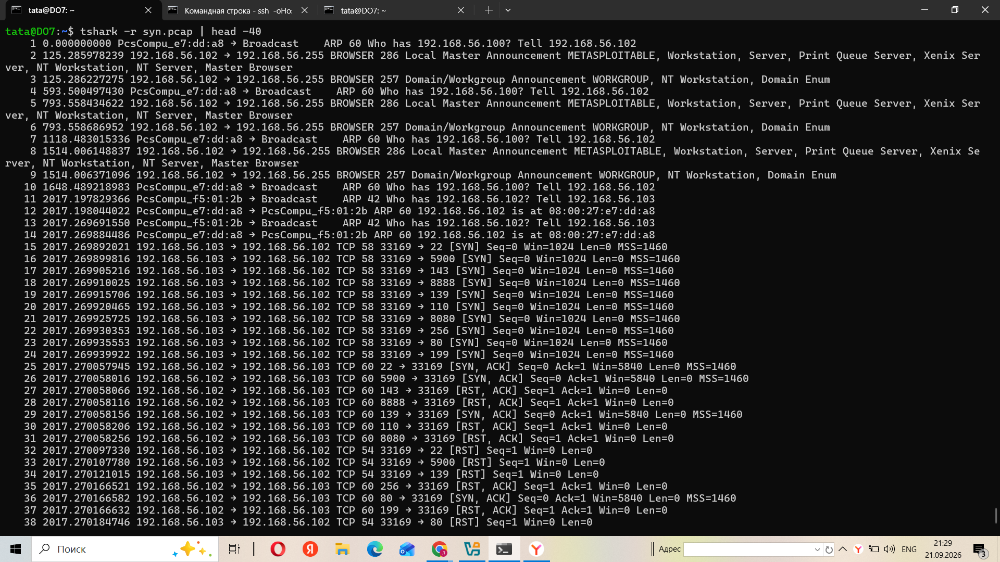
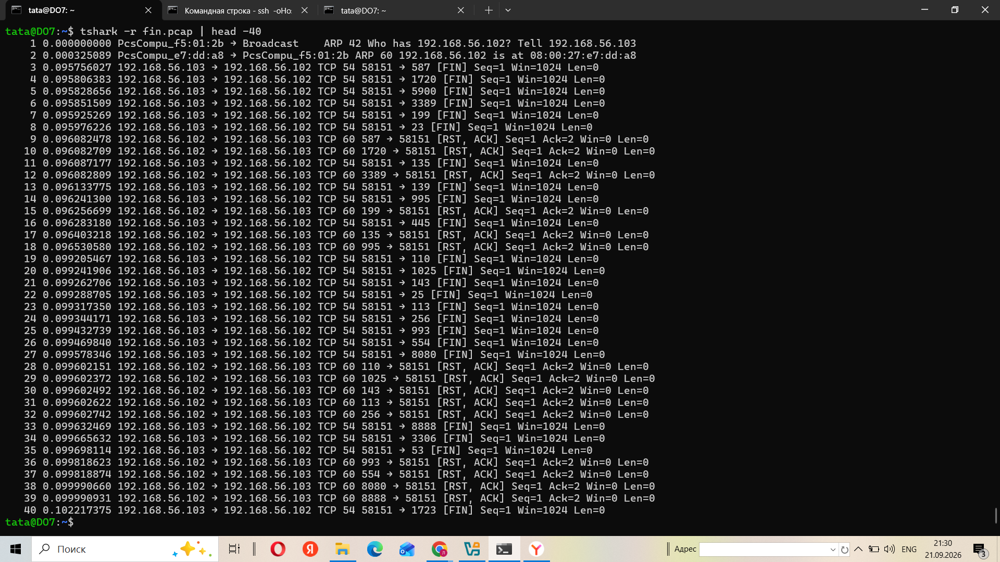
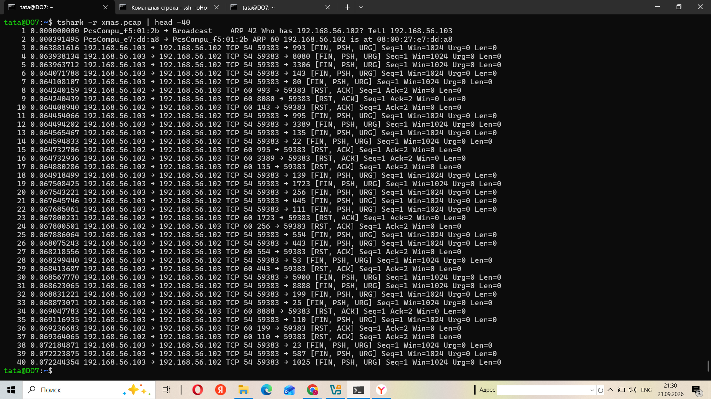
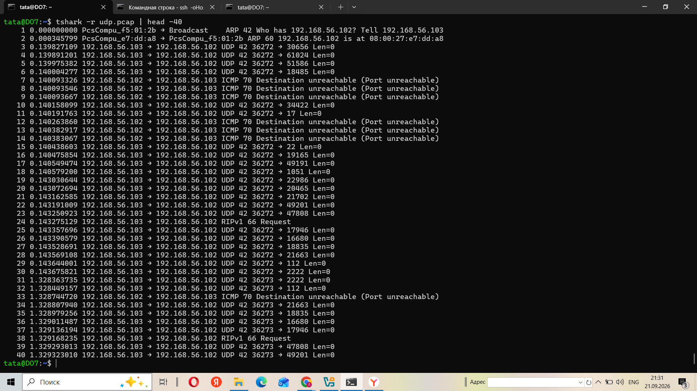

Домашнее задание по занятости «Уязвимости и атаки на информационные системы» - Фабричникова Татьяна Александровна

## Задание 1

Запущены две ВМ : Metasploitable и Ubutu (с которой будет осуществляться сканирование).

Разрешенные сетевые службы: ftp (на 21 и 2121 портах), ssh , telnet, smtp, domain, http (порты 80 и 8180) rpcbind, netbios-ssn, exec, login, shell, java-rmi, bindshell, nfs, mysql, postgresql, vnc, X11, irc, ajp13.

Какие уязвимости были вами обнаружены? (список со ссылками: достаточно трёх уязвимостей)

1. exploit/unix/ftp/vsftpd_234_backdoor https://www.exploit-db.com/exploits/17491 - Получение доступа с правами root
 

2. exploit/linux/postgres/postgres_payload  https://www.exploit-db.com/exploits/46813 - Получение доступа с правами postgres

3. exploit/unix/irc/unreal_ircd_3281_backdoor  https://www.exploit-db.com/exploits/16922 - Получение доступа с правами root 

## Задание 2

Проведите сканирование Metasploitable в режимах SYN, FIN, Xmas, UDP.

Запишите сеансы сканирования в Wireshark.

 - `sudo nmap -sS 192.168.56.102`

>Диагностика в режиме SYN

 - `sudo nmap -sF 192.168.56.102`
   

>Диагностика в режиме FIN

 - `sudo nmap -sX 192.168.56.102`
   

>Диагностика в режиме Xmas

 - `sudo nmap -sU 192.168.56.102`
   

>Диагностика в режиме UDP

Чем отличаются эти режимы сканирования с точки зрения сетевого трафика? Как отвечает сервер?

 - `SYN`	- отправляется TCP-пакет с SYN на каждый порт	.Полуоткрытое соединение: nmap не завершает сессию, а сразу сбрасывает соединение при получении подтверждения соединения от сервера. Если порт открыт SYN+ACK nmap пишет open, если закрыт - RST+ACK (сброс) - closed.
 - `FIN` - 	отправляется один TCP-пакет с FIN. 	Пакет без флагов SYN/RST/ACK обрабатывается по-разному в зависимости от состояния порта, если порт закрыт - сервер отправляет в ответ пакет с флагом сброса соединения RST, если порт открыт - пакет отбрасывается, и становится понятно что порт либо доступен либо фильтруется файрволлом. Если порт открыт ,нет ответа от сервера то open|filtered , если закрыт - RST.
 - `Xmas` - один TCP-пакет с тремя флагами	FIN + PSH + URG. То же самое , что и Fin по смыслу.Если порт открыт ,нет ответа от сервера то open|filtered , если закрыт - RST.
 - `UDP` - отправляется	UDP-пакет.	Не устанавливает соединение, результат зависит от ответа службы. Если пришел UDP ответ то open, если пришёл ICMP Port Unreachable то  closed. Если ответа нет вообще то open|filtered.

