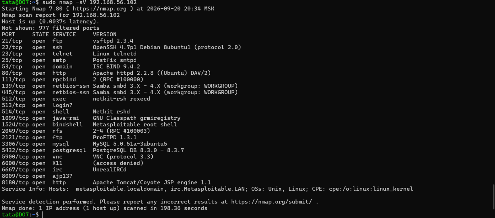
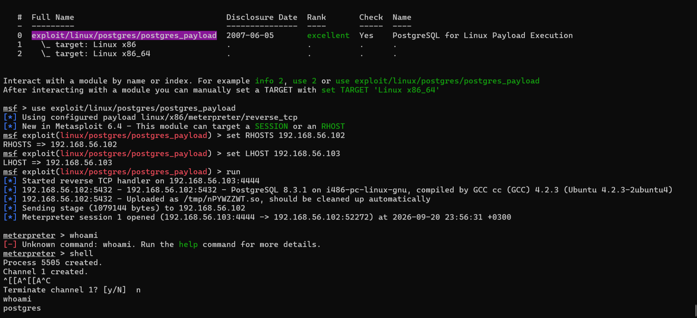
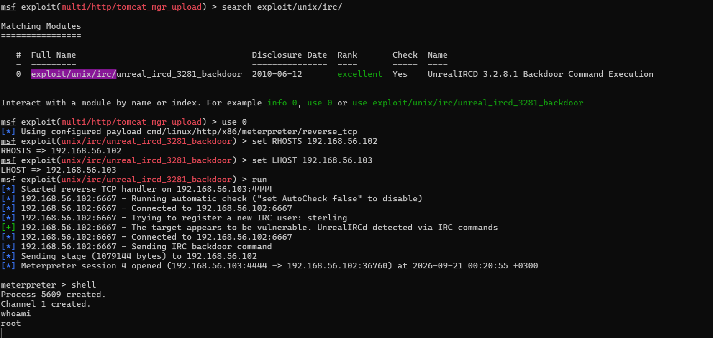

Домашнее задание по занятости " Название занятия" -Фамилия и имя студента

## Задание 1

Запущены две ВМ : Metasploitable и Ubutu (с которой будет осуществляться сканирование).

Разрешенные сетевые службы: ftp (на 21 и 2121 портах), ssh , telnet, smtp, domain, http (порты 80 и 8180) rpcbind, netbios-ssn, exec, login, shell, java-rmi, bindshell, nfs, mysql, postgresql, vnc, X11, irc, ajp13.

Какие уязвимости были вами обнаружены? (список со ссылками: достаточно трёх уязвимостей)

1. exploit/unix/ftp/vsftpd_234_backdoor
 

2. exploit/linux/postgres/postgres_payload

3. exploit/unix/irc/unreal_ircd_3281_backdoor

## Задание 2

Проведите сканирование Metasploitable в режимах SYN, FIN, Xmas, UDP.

Запишите сеансы сканирования в Wireshark.

Ответьте на следующие вопросы:

Чем отличаются эти режимы сканирования с точки зрения сетевого трафика?
Как отвечает сервер?
Приведите ответ в свободной форме.

При необходимости прикрепитe сюда скриншоты 

